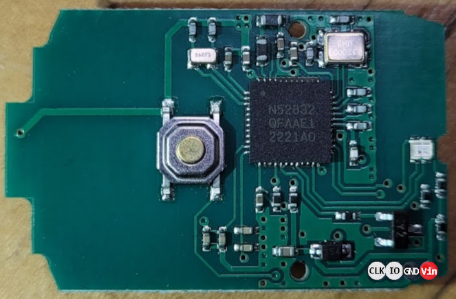

Programing AmiLoop with Raspberry Pi
==============

Install OpenOCD
-------------

Install the tools we need to get and compile OpenOCD:

```shell
sudo apt-get update
sudo apt install automake autoconf build-essential texinfo libtool libftdi-dev libusb-1.0-0-dev
```

Download the latest source code for OpenOCD with:

```shell
git clone http://openocd.zylin.com/openocd
```

Configure for the Pi and it's gpio:

```shell
cd openocd
./bootstrap
./configure --enable-sysfsgpio --enable-bcm2835gpio
```

Make and install:
```shell
make
sudo make install
```

Connect the AmiLoop
-------------



Make the following connections between the AmiLoop and the Pi

|AmiLoop|Raspberry Pi|Pi GPIO|
|--|--|--|
|`Vin`|`3.3v`|`Pin 1`|
|`GND`|`GND`|`Pin 20`|
|`IO`|`GPIO 8`|`Pin 24`|
|`CLK`|`GPIO 11`|`Pin 23`|


The end result should look like this (ignore brown wire in picture):


Flash the AmiLoop
-------------

From the root of this repository run the following command:
```shell
openocd -f amiloopv4.cfg
```

To flash the older v3 firmware instead, use this command:
```shell
openocd -f amiloopv3.cfg
```

To flash a different hex file, make a copy of one of the cfg files and modify the file name on line 11